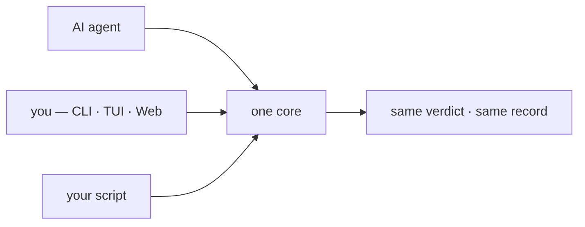
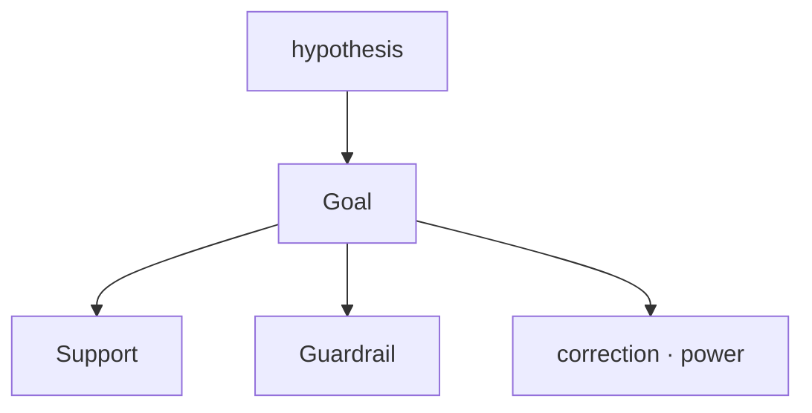
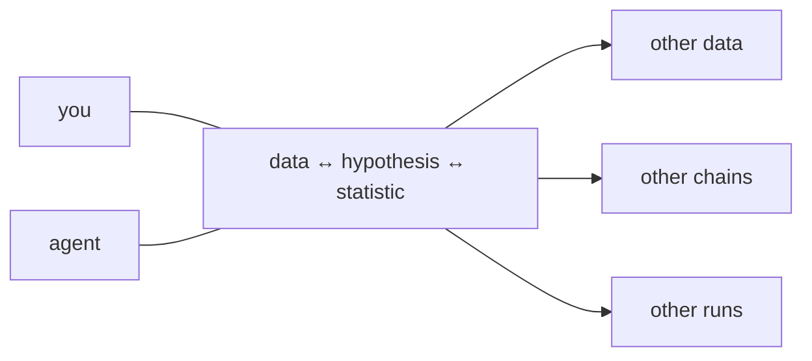

# STATOP — STATistic Ontology Platform

**Closing the statistics gap between AI agents and human users — by keeping the
reasoning as an ontology, not just the number.**

`v1.0.0-proto` · runs entirely on your machine · no server, no account

---

## Three ideas

**1 · Same statistics, whoever runs them.**
An agent call, a hand-written script, a click in the UI — one core, one record.



**2 · A hypothesis is more than one number.**
The Goal metric, the Support metrics that explain it, the Guardrail metrics that
would break it — on one screen, with correction and power.



**3 · The link is kept.**
What a column is, what was asked of it, which rule allowed the test — recorded as
a chain. The same chain runs on other data; the same data runs under other chains;
two runs are compared by reading two files — by you, or by an agent you ask.



## Three questions it answers

| | |
|---|---|
| **Is this data intact?** | `statop integrity a.csv b.csv` — what changed, and where |
| **Does this statistic fit this hypothesis?** | `statop analyze plan` — applicable tests only, with reasons |
| **Which statistic fits this hypothesis?** | pick the question in plain words, get candidates |

---

## Install

Needs [conda](https://docs.conda.io/en/latest/miniconda.html).

```bash
git clone https://github.com/WoobeenJeong/STATOP_public.git statop
cd statop
conda env create -f environment.yml
conda activate statop
pip install -e .
```

Check: `statop --help` works, `pytest -q` says 949 passed.

## Two ways to drive it

**Terminal** — `statop`

<!-- docs/img/tui.png -->

**Web** — `statop serve` → `http://127.0.0.1:8000/ui`

<!-- docs/img/web.png -->

Same screens, same core. To look without installing anything, open
[`demo/talk/001.html`](demo/talk/001.html) in a browser.

## Six steps

```bash
F=demo/talk/001_group_correlation.csv

statop session new --data $F                              # 1. load data
statop select $F --cols group,cfdna_conc,immune_ratio     # 2. pick columns
statop types --confirm cfdna_conc --as continuous         # 3. confirm what each column is
statop analyze plan --question Q-03 \
       --y cfdna_conc --group immune_ratio --apply        # 4. state the hypothesis
                                                          # 5. plan shows which tests fit
statop analyze run --test T-304                           # 6. run one test
```

`--question Q-03` = "do these two values move together?" — `statop analyze
questions` lists all twelve in everyday words. `--y` is the value you look at,
`--group` is what it is compared against.

Reuse later, on other data:

```bash
statop formula save  --name log_conc --expr "ln(cfdna_conc)"
statop formula apply --name log_conc --map cfdna_conc=frag_len_mean  # re-judged there
statop session save && statop session load <name>                    # replay a whole run
```

A saved session is a short list — `open → select → semantic_confirm →
analysis_spec → test_result` — and **no data cells, ever**. Open two to compare
them yourself, or hand both to an agent: "name the step that differs."

<!-- agent-notes:start -->
## With an AI agent

`CLAUDE.md` / `AGENTS.md` are in the repo; an agent picks them up on entry.

| you want | ask for |
|---|---|
| first look | `statop columns my.csv` → "flag columns whose type looks wrong" |
| pick a test | `statop analyze plan ...` → "keep only ✅, say why ⚠ is ⚠" |
| why blocked | "quote the reason from `rules/tests.yaml`" |
| compare runs | "read these two session files, name the step that differs" |

Let STATOP judge; let the agent explain. Every verdict has written grounds in
`rules/`, so the agent cites instead of inventing.

<!-- agent-notes:end -->

## Bundled examples (all synthetic)

| file | shows |
|---|---|
| `demo/talk/001_group_correlation.csv` | a relation only one group bends — correlation misses it, distance correlation does not |
| `demo/talk/002_entropy_wrong_dist.csv` | the distribution assumption decides the answer |
| `demo/talk/003a·003b_integrity.csv` | two exports of one table — pairing reveals the drift |

`python demo/verify_talk.py` confirms each still behaves as planted.

## Troubleshooting

| symptom | cause |
|---|---|
| `statop: command not found` | `conda activate statop` not run, or `pip install -e .` missing |
| web will not open | keep the `statop serve` terminal open; the path ends in `/ui` |
| broken Korean text | terminal to UTF-8 (Windows: `chcp 65001`) |
| no tests offered | pick **two** columns and confirm their types |

Storage: `~/.statop/<user>/` (`STATOP_HOME` overrides). Messages: `--lang en`.

---
---

# 한국어

**STATOP — Agent 와 사람 사이의 통계 이해 격차를 줄이는 온톨로지.**
숫자만 남기지 않고, 그 숫자가 나온 **근거의 사슬**을 남깁니다.

## 세 가지 생각

**1 · 누가 돌려도 같은 통계.** 에이전트 호출, 손으로 짠 코드, 화면 클릭 —
같은 코어를 지나 같은 기록을 남깁니다.

**2 · 가설은 숫자 하나가 아닙니다.** 목표 지표(Goal), 설명하는 지표(Support),
틀어지면 막는 지표(Guardrail)를 보정·검정력과 함께 한 화면에서 봅니다.

**3 · 관계를 남깁니다.** 컬럼이 무엇인지 → 무엇을 물었는지 → 어느 규칙이
허락했는지가 사슬로 기록됩니다. 같은 사슬을 다른 자료에, 같은 자료를 다른
사슬로. 두 실행의 비교는 **사람도 두 파일을 열어 직접, 에이전트도 같은 두
파일로** — 똑같이 합니다.

## 세 가지 질문

| | |
|---|---|
| **이 데이터, 무결한가?** | `statop integrity a.csv b.csv` — 무엇이 어디서 바뀌었나 |
| **이 가설에 이 통계량이 맞나?** | `statop analyze plan` — 쓸 수 있는 검정만, 이유와 함께 |
| **이 가설엔 어떤 통계량이 맞나?** | 질문을 일상어로 고르면 후보가 나온다 |

## 설치

[conda](https://docs.conda.io/en/latest/miniconda.html) 가 필요합니다.

```bash
git clone https://github.com/WoobeenJeong/STATOP_public.git statop
cd statop
conda env create -f environment.yml    # 몇 분
conda activate statop                  # 터미널 열 때마다
pip install -e .
```

확인: `statop --help` 가 뜨고 `pytest -q` 가 949 passed.

## 조작은 두 가지

- **터미널**: `statop`
- **웹**: `statop serve` → `http://127.0.0.1:8000/ui`

설치 없이 구경만 하려면 `demo/talk/001.html` 더블클릭 (002·003 도 있습니다).

## 여섯 단계

```bash
F=demo/talk/001_group_correlation.csv
statop session new --data $F                              # 1. 데이터 load
statop select $F --cols group,cfdna_conc,immune_ratio     # 2. 컬럼 선택
statop types --confirm cfdna_conc --as continuous         # 3. 타입 확정
statop analyze plan --question Q-03 \
       --y cfdna_conc --group immune_ratio --apply        # 4. 가설 지정
                                                          # 5. plan 이 맞는 검정을 보여줌
statop analyze run --test T-304                           # 6. 검정 실행
```

`--question Q-03` 은 "이 두 값이 같이 움직이나", `--y` 는 보려는 값,
`--group` 은 견줄 상대입니다. 질문 12가지는 `statop analyze questions`.

나중에 다시 쓰기:

```bash
statop formula save  --name log_conc --expr "ln(cfdna_conc)"
statop formula apply --name log_conc --map cfdna_conc=frag_len_mean  # 다른 자료에서 재판정
statop session save && statop session load <이름>                     # 실행 전체 재생
```

저장된 세션은 짧은 조작 목록이고 **자료 칸은 절대 안 들어갑니다.**
둘을 열어 직접 비교하거나, 에이전트에게 "달라진 단계를 짚어 줘"라고 시킵니다.

## 막히면

| 증상 | 까닭 |
|---|---|
| `statop: command not found` | `conda activate statop` 또는 `pip install -e .` 빠짐 |
| 웹이 안 열림 | `statop serve` 터미널 유지, 주소 끝 `/ui` |
| 한글 깨짐 | 터미널 UTF-8 (Windows `chcp 65001`) |
| 검정이 안 뜸 | 컬럼 **두 개** + 타입 확정 |

저장: `~/.statop/<사용자>/` (`STATOP_HOME` 로 변경) · 영어 메시지는 `--lang en`.
