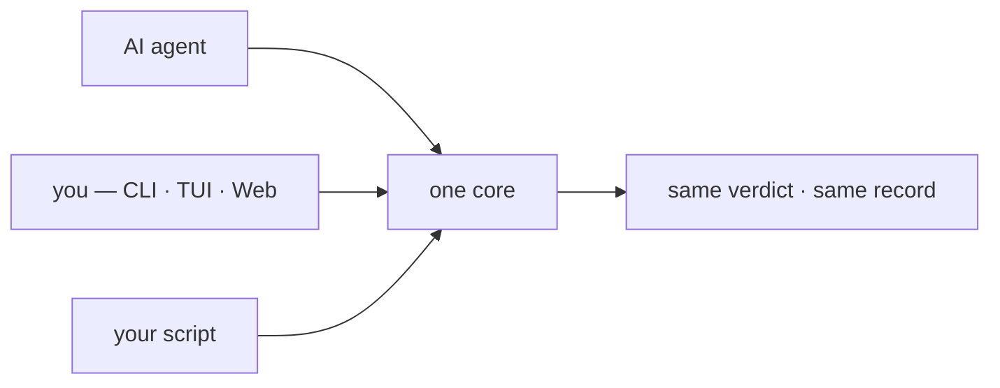
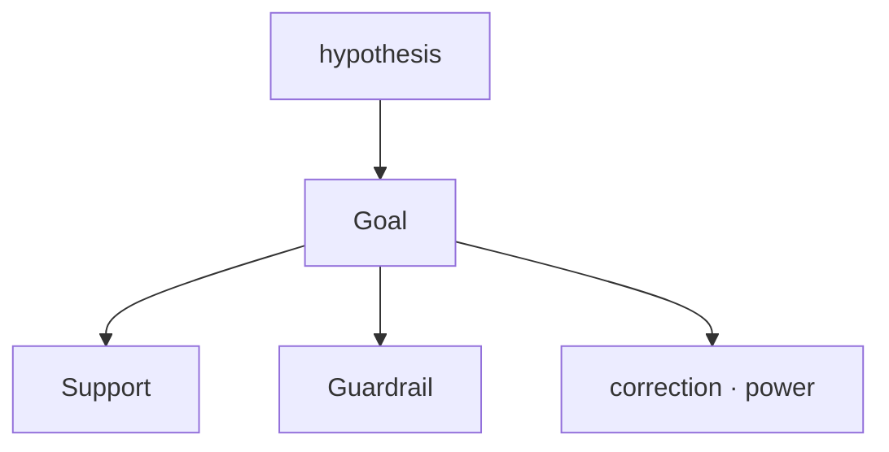
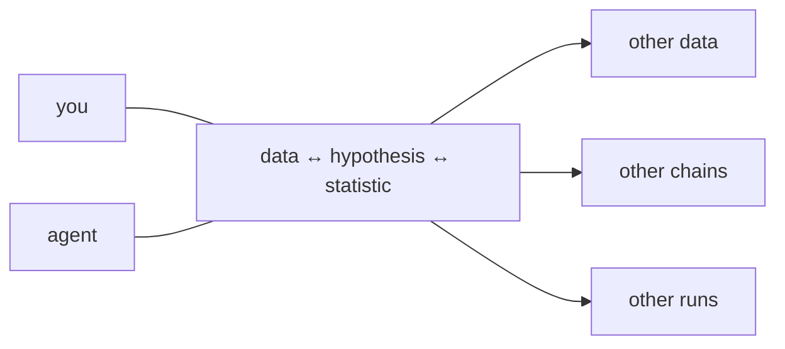

# STATOP — STATistic Ontology Platform

**Closing the statistics gap between AI agents and human users — by keeping the
reasoning as an ontology, not just the number.**

`v1.0.0-proto` · runs entirely on your machine · no server, no account

---

## Three ideas

**1 · Same statistics, whoever runs them.**
An agent call, a hand-written script, a click in the UI — one core, one record.



**2 · A hypothesis is more than one number.**
The Goal metric, the Support metrics that explain it, the Guardrail metrics that
would break it — on one screen, with correction and power.



**3 · The link is kept.**
What a column is, what was asked of it, which rule allowed the test — recorded as
a chain. The same chain runs on other data; the same data runs under other chains;
two runs are compared by reading two records — by you, or by an agent you ask.



## Three questions it answers

| | |
|---|---|
| **Is this data intact?** | two exports of one table — what changed, and where |
| **Does this statistic fit this hypothesis?** | applicable tests only, each with its reason |
| **Which statistic fits this hypothesis?** | pick the question in plain words, get candidates |

---

## Install

Needs [conda](https://docs.conda.io/en/latest/miniconda.html).

```bash
git clone https://github.com/WoobeenJeong/STATOP_public.git statop
cd statop
conda env create -f environment.yml
conda activate statop
pip install -e .
```

Check: `statop --help` works, `pytest -q` says 949 passed.

## Two ways to drive it

**Terminal** — `statop`


**Web** — `statop serve`


<details>
<summary>그림 열기 — 타입 추론 및 분포 관찰</summary>


</details>

<details>
<summary>그림 열기 — 통계량 및 가설 저장</summary>


</details>

Everything below is clicking. Nothing has to be typed except a file path.

## Six steps

| | you click | and you get |
|---|---|---|
| 1 | **열기** on a file | the columns, with missing rate and unique count |
| 2 | **가져오기** after ticking columns | a work area holding only those |
| 3 | **타입 확정** on each column | what it is — a label opens 0/1 mapping right there |
| 4 | **지표 찾기** → a question → two columns | the tests that fit, ✅ / ⚠ / ⛔ with reasons |
| 5 | **고르기** on one test | the value, p, and whether this sample could catch it |
| 6 | **Goal로** | Support and Guardrail metrics to report alongside |

Along the way: **그림** draws it, **색으로 나누기** splits by group, **목표 검정력**
moves the power target, **수식·근거** shows the rule that decided it.

Two more screens: **무결성 검증** compares two files, **파생 컬럼** builds a new one
from a formula — and a saved formula can be reapplied to a different dataset,
where it is re-judged rather than assumed.

<!-- agent-notes:start -->
## With an AI agent

`CLAUDE.md` / `AGENTS.md` ship with the repo, so an agent reads the rules on entry.
Let STATOP judge and the agent explain — every verdict has written grounds in
`rules/`, and two saved sessions can simply be handed over: *"name the step that
differs."*

<!-- agent-notes:end -->

## Bundled examples (all synthetic)

| file | shows |
|---|---|
| `demo/talk/001_group_correlation.csv` | a relation only one group bends — correlation misses it, distance correlation does not |
| `demo/talk/002_entropy_wrong_dist.csv` | the distribution assumption decides the answer |
| `demo/talk/003a·003b_integrity.csv` | two exports of one table — pairing reveals the drift |

Open [`demo/talk/001.html`](demo/talk/001.html) in a browser to look without installing.

---
---

# 한국어

**STATOP — Agent 와 사람 사이의 통계 이해 격차를 줄이는 온톨로지.**
숫자만 남기지 않고, 그 숫자가 나온 **근거의 사슬**을 남깁니다.

## 세 가지 생각

**1 · 누가 돌려도 같은 통계.** 에이전트 호출, 손으로 짠 코드, 화면 클릭 —
같은 코어를 지나 같은 기록을 남깁니다.

**2 · 가설은 숫자 하나가 아닙니다.** 목표 지표(Goal), 설명하는 지표(Support),
틀어지면 막는 지표(Guardrail)를 보정·검정력과 함께 한 화면에서 봅니다.

**3 · 관계를 남깁니다.** 컬럼이 무엇인지 → 무엇을 물었는지 → 어느 규칙이
허락했는지가 사슬로 기록됩니다. 같은 사슬을 다른 자료에, 같은 자료를 다른
사슬로. 두 실행의 비교는 **사람도 두 기록을 열어 직접, 에이전트도 같은 두
기록으로** — 똑같이 합니다.

## 세 가지 질문

| | |
|---|---|
| **이 데이터, 무결한가?** | 같은 표를 두 번 내보냈을 때 무엇이 어디서 바뀌었나 |
| **이 가설에 이 통계량이 맞나?** | 쓸 수 있는 검정만, 각각 이유와 함께 |
| **이 가설엔 어떤 통계량이 맞나?** | 질문을 일상어로 고르면 후보가 나온다 |

## 설치

[conda](https://docs.conda.io/en/latest/miniconda.html) 가 필요합니다.

```bash
git clone https://github.com/WoobeenJeong/STATOP_public.git statop
cd statop
conda env create -f environment.yml    # 몇 분
conda activate statop                  # 터미널 열 때마다
pip install -e .
```

확인: `statop --help` 가 뜨고 `pytest -q` 가 949 passed.

## 조작은 두 가지

- **터미널**: `statop`
- **웹**: `statop serve`


<details>
<summary>그림 열기 — 타입 추론 및 분포 관찰</summary>


</details>

<details>
<summary>그림 열기 — 통계량 및 가설 저장</summary>


</details>

아래는 전부 클릭입니다. 직접 치는 것은 파일 경로뿐입니다.

## 여섯 단계

| | 누르면 | 나오는 것 |
|---|---|---|
| 1 | 파일에 **열기** | 컬럼 목록 · 결측률 · 고유값 수 |
| 2 | 체크 후 **가져오기** | 그 컬럼만 담긴 작업 영역 |
| 3 | 컬럼마다 **타입 확정** | 그게 무엇인지 — 라벨이면 0/1 코드 지정이 바로 뜸 |
| 4 | **지표 찾기** → 질문 → 컬럼 둘 | 맞는 검정들, ✅ / ⚠ / ⛔ 과 이유 |
| 5 | 검정 하나에 **고르기** | 값·p, 그리고 이 표본으로 잡히는 크기인지 |
| 6 | **Goal로** | 함께 볼 Support · Guardrail 지표 |

가는 길에 — **그림**으로 그리고, **색으로 나누기**로 군을 가르고,
**목표 검정력**으로 기준을 옮기고, **수식·근거**로 그 판정의 규칙을 봅니다.

화면 둘 더 — **무결성 검증**은 두 파일을 대조하고, **파생 컬럼**은 수식으로 새
컬럼을 만듭니다. 저장한 수식은 다른 자료에 다시 쓸 수 있고, 그때 **새 자료에서
다시 판정**합니다.

## 에이전트와 함께

`CLAUDE.md` · `AGENTS.md` 가 들어 있어 에이전트가 들어오면 규칙을 읽습니다.
판정은 STATOP 이, 설명은 에이전트가 — 근거가 `rules/` 에 글로 적혀 있어
지어내지 않고 인용합니다. 세션 둘을 건네며 *"달라진 단계를 짚어 줘"* 도 됩니다.

## 딸려 오는 예제 (전부 합성)

| 파일 | 보여주는 것 |
|---|---|
| `demo/talk/001_group_correlation.csv` | 한 군만 휘는 관계 — 상관은 놓치고 거리상관은 잡는다 |
| `demo/talk/002_entropy_wrong_dist.csv` | 분포를 무엇으로 보았는가가 답을 바꾼다 |
| `demo/talk/003a·003b_integrity.csv` | 같은 표의 두 판본 — 짝을 지어야 차이가 보인다 |

설치 없이 보려면 `demo/talk/001.html` 을 브라우저로 엽니다.

---

## Troubleshooting · 막히면

| symptom | 증상 | cause | 까닭 |
|---|---|---|---|
| `statop: command not found` | 명령을 못 찾음 | `conda activate statop` not run | `conda activate statop` 을 빠뜨림 |
| web will not open | 웹이 안 열림 | the `statop serve` terminal was closed | `statop serve` 터미널을 닫음 |
| garbled Korean | 한글이 깨짐 | terminal is not UTF-8 | 터미널 인코딩 (Windows `chcp 65001`) |
| no tests offered | 검정이 안 뜸 | fewer than two columns, or types unconfirmed | 컬럼이 둘 미만이거나 타입 미확정 |

Storage · 저장 위치 `~/.statop/<user>/` (`STATOP_HOME`) · English messages `--lang en`
