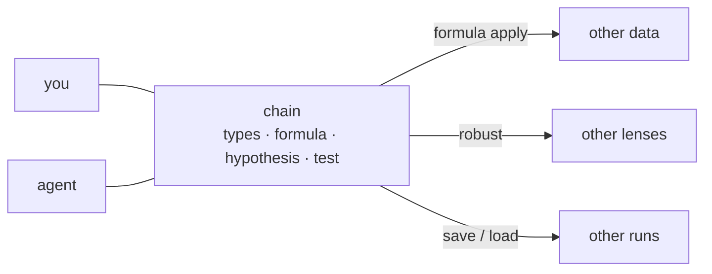

# STATOP — STATistic Ontology Platform

A local tool that checks whether an analysis fits the data before it runs one,
and keeps the reasoning so it can be reused and questioned later.

`v1.0.0-proto` · runs entirely on your machine · no server, no account

---

## What problem this solves

A reported number does not say whether it should have been computed.
When an AI agent, a colleague and an old notebook each produce a statistic,
they can disagree about **which test was appropriate** and nobody notices,
because all three only report the number.

STATOP holds onto the part that usually gets thrown away:

- **what each column actually is** (an ID? a group? a proportion?)
- **what was asked of it** (the hypothesis, in plain terms)
- **which rule permitted the test**, and which blocked it

That record is what makes two people — or a person and an agent — comparable.

---

## Install

Needs [conda](https://docs.conda.io/en/latest/miniconda.html).

```bash
git clone https://github.com/WoobeenJeong/STATOP_public.git statop
cd statop
conda env create -f environment.yml     # a few minutes
conda activate statop
pip install -e .
```

Verify:

```bash
statop --help
pytest -q          # 949 passed
```

The web UI is pre-built; Node is not required to use it.

---

## Running

```bash
statop             # full-screen terminal (start here)
statop serve       # web UI at http://127.0.0.1:8000/ui
statop <command>   # one step at a time — for scripts and agents
```

Messages are Korean by default. `--lang en` switches them.

---

## The workflow

Six steps. Each one is a command, and each one is recorded.

```bash
F=demo/talk/001_group_correlation.csv

# 1. look at the file — no session needed
statop columns $F

# 2. start a session. The file is not copied; only its path and a hash are kept.
statop session new --data $F

# 3. choose which columns you will work with
statop select $F --cols sample_id,group,cfdna_conc,immune_ratio

# 4. say what each column IS. This is the step that decides everything after it.
statop types                                   # shows candidates and the evidence
statop types --confirm group        --as label
statop types --confirm cfdna_conc   --as continuous
statop types --confirm immune_ratio --as proportion

# 5. state the question, then record it
statop analyze plan --question Q-03 --y cfdna_conc --group immune_ratio
statop analyze plan --question Q-03 --y cfdna_conc --group immune_ratio --apply

# 6. run one chosen test
statop analyze run --test T-304
```

**Step 5 in plain words.** `--question Q-03` means *"do these two values move
together?"*. `--y` is the value you are looking at; `--group` is the second
variable it is compared against. `statop analyze questions` lists all twelve
question types with their everyday phrasing — you pick by meaning, not by code.

Step 5 without `--apply` only *shows* you which tests fit:

```
✅ T-304  Distance correlation  — fits          비선형·비단조 의심
✅ T-305  Biweight midcorrelation — fits        outlier 있는데 선형 유지
⚠  T-301  Pearson r  — check first              가정 C-01, C-03, C-08 미확인
```

Step 6 prints the result with the conditions attached:

```
검정 실행: T-304 Distance correlation
  통계량 0.3018 · p = 0.00333
  dCor = 0.302          n: pairs=145
  직선이 아닌 관계도 잡습니다 — 0이면 독립이지만 방향은 없습니다
  계획 검정 1개 기준 보정 α = 0.05 — p는 이 값과 비교하세요
```

---

## The chain, and what you can do with it

Every session records one chain:

```
data → what each column is → the hypothesis → which test was allowed → the result
```

Because the chain is an object rather than a habit, it moves in two directions.

**One chain, different data.** A derived column is usually a decision, not a
detail — "this concentration spreads multiplicatively, so take the log". Save it
by name and the columns it used become input slots:

```bash
statop formula save  --name log_conc --expr "ln(cfdna_conc)"
statop formula apply --name log_conc --map cfdna_conc=frag_len_mean
```

```
별로 — 확인이 필요합니다
  의미 타입 미확정: frag_len_mean — 확정 후 판정이 정확해집니다
적용: log_conc (cfdna_conc→frag_len_mean) → ln(frag_len_mean)
```

It does not apply silently. It re-judges the fit **on the new data** and says
what is still unconfirmed — the old decision is offered, not imposed.

**One dataset, different chains.** Under a single hypothesis you can run several
tests and see where they disagree. `statop robust` does the sweep in one go:

```
① 표본을 다시 뽑으면 (200회) — 가운데 90% 가 -0.4022 ~ -0.156
② 이상치를 빼면 — 상·하위 5% 제거: r=-0.2443 · p=0.00528
③ 고른 것을 바꾸면
   T-302 Spearman ρ: rho=-0.2968 · p=0.000289
   T-304 Distance correlation: dCor=0.3018 · p=0.00333  ← 방향 뒤집힘
```

The last line is the point: the same data under a different lens does not merely
shift the number, it can reverse the reading. That is visible here, in one place.

**Comparing runs.**

```bash
statop session save            # auto-named: date_project_mode_tag_rows_time
statop session load <name>     # re-verifies the source, then replays every step
```

A saved session is a short, ordered list:

```
open → select → semantic_confirm(…) → analysis_spec → test_result
```

When the same hypothesis worked last quarter and does not now:

- **you** open the two sessions and read them side by side;
- **an agent** is told "compare these two sessions, name the step that differs".

Same files, same comparison. Neither side has a privileged view — either of you
can point at the exact step you disagree with.



Data cells are never written. The log holds operations only, so a session can be
handed over without the data.

## Working with an AI agent

The repo ships `CLAUDE.md` / `AGENTS.md`, so an agent reads the rules on entry.
Tell it:

```
This repo is STATOP, a local statistics validation tool.
- Environment: conda activate statop
- rules/*.yaml decides what may be used and why not. Do not hand-edit it —
  schema/registry-*.md is the source, python -m statop.rules.build regenerates it.
- Flow: session new → select → types --confirm → analyze plan --apply → analyze run
- Data cells are never stored; the session log holds operations only.
```

| you want | ask for |
|---|---|
| a first look | `statop columns my.csv`, then "flag columns whose inferred type looks wrong" |
| choosing a test | `statop analyze plan ...`, then "keep only the ✅ ones and say why the ⚠ are ⚠" |
| why something is blocked | "quote the reason from `rules/tests.yaml`" |
| reproducibility | `statop report`, then "build a replay script from the session log" |

**Let STATOP judge; let the agent explain.** Every verdict has written grounds in
`rules/`, so an agent can cite them instead of inventing a justification.

---

## Bundled examples

All synthetic. No real specimen or patient data is included.

| file | what it demonstrates |
|---|---|
| `demo/talk/001_group_correlation.csv` | a relation that bends in one group only — correlation misses it, distance correlation does not |
| `demo/talk/002_entropy_wrong_dist.csv` | the distribution assumption decides the answer; one derived column changes the conclusion |
| `demo/talk/003a·003b_integrity.csv` | two exports of one table — pairing renamed columns is what reveals the drift |

`python demo/verify_talk.py` confirms each example still behaves as intended.
`demo/talk/001.html` opens in a browser with no install.

---

## Layout

```
src/statop/   core — CLI, terminal UI and the web API all use this
rules/        rule DB (yaml): what may be used, and why not
schema/       source of the rule DB; regenerate after editing
ui/           web UI (dist is pre-built)
demo/         synthetic data and three standalone walkthroughs
tests/        949
```

---

## Troubleshooting

| symptom | cause |
|---|---|
| `statop: command not found` | `conda activate statop` not run, or `pip install -e .` missing |
| web will not open | keep the `statop serve` terminal open; the path ends in `/ui` |
| Korean text is garbled | set the terminal to UTF-8 (Windows: `chcp 65001`) |
| no tests are offered | pick **two** columns and confirm their types — the screen names what is missing |

Storage: `~/.statop/<user>/`. Override with `STATOP_HOME`.

---
---

# 한국어

**STATOP** — 분석을 돌리기 전에 **이 자료에 이 분석이 맞는지** 확인하고,
그 판단 근거를 남겨 나중에 다시 쓰고 따져볼 수 있게 하는 도구입니다.

## 무엇을 푸는가

보고된 숫자만으로는 그 숫자를 **계산했어야 했는지**를 알 수 없습니다.
에이전트와 동료와 옛날 노트북이 각각 통계를 내면, 어느 검정이 맞았는지에 대해
서로 다른 생각을 하면서도 아무도 모릅니다 — 셋 다 숫자만 보고하기 때문입니다.

STATOP 은 보통 버려지는 쪽을 붙잡아 둡니다: **컬럼이 실제로 무엇인지**,
**그것에 무엇을 물었는지**, **어느 규칙이 그 검정을 허락했고 무엇을 막았는지**.

## 설치

[conda](https://docs.conda.io/en/latest/miniconda.html) 가 필요합니다.

```bash
git clone https://github.com/WoobeenJeong/STATOP_public.git statop
cd statop
conda env create -f environment.yml     # 몇 분 걸립니다
conda activate statop                   # 터미널을 새로 열 때마다 필요합니다
pip install -e .
```

확인: `statop --help` 가 뜨고 `pytest -q` 가 949 passed 면 정상입니다.

## 실행

```bash
statop             # 터미널 전체화면 — 처음이면 이것
statop serve       # 웹 → http://127.0.0.1:8000/ui
```

## 작업 순서 — 여섯 단계

```bash
F=demo/talk/001_group_correlation.csv

statop columns $F                     # 1. 파일에 무엇이 있나
statop session new --data $F          # 2. 세션 시작 (파일은 복사하지 않습니다)
statop select $F --cols sample_id,group,cfdna_conc,immune_ratio   # 3. 쓸 컬럼
statop types --confirm group --as label                           # 4. 각 컬럼이 무엇인지
statop analyze plan --question Q-03 --y cfdna_conc --group immune_ratio --apply   # 5. 질문
statop analyze run --test T-304       # 6. 고른 검정 하나만
```

**5번을 쉬운 말로.** `--question Q-03` 은 *"이 두 값이 같이 움직이나"* 라는 뜻이고,
`--y` 는 **보려는 값**, `--group` 은 **그 값과 견줄 상대**입니다.
`statop analyze questions` 를 치면 열두 가지 질문이 일상어 설명과 함께 나옵니다 —
코드가 아니라 **뜻으로 고릅니다**.

4번이 가장 중요합니다. 컬럼이 무엇인지 확정해야 그 뒤가 전부 정해집니다.

## 사슬 — 남긴 것으로 할 수 있는 일

세션마다 사슬 하나가 남습니다:

```
자료 → 각 컬럼이 무엇인지 → 가설 → 허락된 검정 → 결과
```

이 사슬은 양방향으로 씁니다.

**같은 사슬, 다른 자료.** 파생 컬럼은 결정입니다("이 농도는 비율로 퍼지니 로그").
이름으로 저장하면 쓰인 컬럼이 입력 슬롯이 됩니다:

```bash
statop formula save  --name log_conc --expr "ln(cfdna_conc)"
statop formula apply --name log_conc --map cfdna_conc=frag_len_mean   # 다른 자료에서
```

그냥 적용되지 않습니다 — **새 자료에서 적합성을 다시 판정**하고, 무엇이 아직
미확정인지 알려 줍니다.

**같은 자료, 다른 사슬.** 한 가설 아래 여러 검정을 돌려 어디서 갈리는지 봅니다.
`statop robust` 가 한 번에 훑습니다:

```
① 표본을 다시 뽑으면 — 가운데 90% 가 -0.40 ~ -0.16
② 이상치를 빼면 — 상·하위 5% 제거: r=-0.244
③ 고른 것을 바꾸면 — Spearman -0.297 · dCor 0.302 ← 방향 뒤집힘
```

**세션 비교.**

```bash
statop session save            # 자동 이름: 날짜_프로젝트_모드_태그_행수_시각
statop session load <이름>     # 원본 재확인 후 조작을 처음부터 재생
```

저장본은 짧은 조작 목록입니다: `open → select → semantic_confirm → analysis_spec
→ test_result`. 같은 가설이 저번엔 나왔는데 지금은 안 나올 때 —

- **사람**은 두 세션을 열어 나란히 읽고,
- **에이전트**에게는 "이 두 세션을 비교해서 달라진 단계를 짚어 줘"라고 시킵니다.

같은 파일, 같은 비교입니다. 어느 쪽도 더 많이 보지 않습니다.

**자료 칸은 기록되지 않습니다.** 조작만 남으므로 세션은 자료 없이 건넬 수 있습니다.

## 막히면

| 증상 | 까닭 |
|---|---|
| `statop: command not found` | `conda activate statop` 을 빠뜨렸거나 `pip install -e .` 전입니다 |
| 웹이 안 열림 | `statop serve` 터미널을 닫지 마세요. 주소 끝에 `/ui` 가 붙습니다 |
| 한글이 깨짐 | 터미널 인코딩을 UTF-8 로 (Windows: `chcp 65001`) |
| 검정이 안 뜸 | 컬럼을 **두 개** 골랐는지, 의미 타입을 확정했는지 보세요 |

저장 위치는 `~/.statop/<사용자>/`, `STATOP_HOME` 으로 바꿉니다.
메시지를 영어로 보려면 `--lang en` 입니다.
