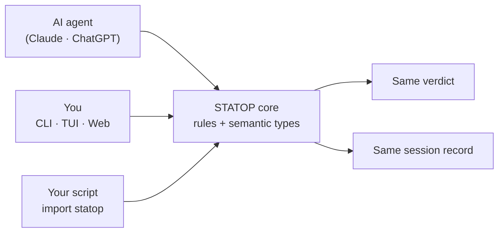
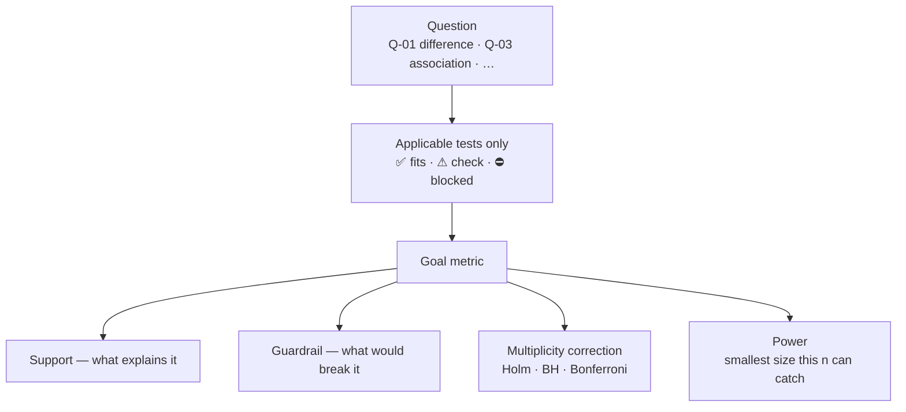
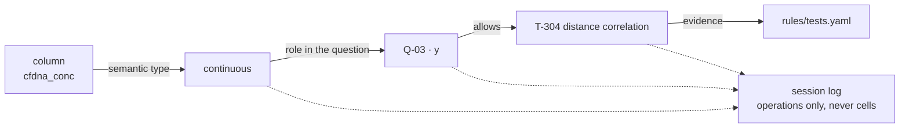

<div align="center">

# STATOP

**STAT**istic **O**ntology **P**latform

*Not a tool that runs your statistics — a tool that first asks whether this analysis fits this data.*

`v1.0.0-proto` · runs fully local · no server, no account, no internet

</div>

---

## Why

A number alone does not say whether it should have been computed.
When an AI agent, a teammate, and a notebook each reach for a statistic,
they can disagree about **which test was appropriate** and never notice —
because each of them only reports the number.

STATOP keeps three things aligned.

### 1 · One sink for statistics

An agent call, a hand-written script, and a click in the UI all go through the
**same core** and leave the **same record**. So "what the agent did" and "what
I did" are comparable by construction, not by trust.



### 2 · Many metrics, one view

A hypothesis is rarely one number. STATOP puts the **Goal** metric, the
**Support** metrics that explain it, and the **Guardrail** metrics that would
invalidate it on one screen — together with multiplicity correction and power.



### 3 · The link is kept, not just the number

Every step records *what a column means*, *what was asked of it*, and *which
rule allowed the test*. The session file is that chain — an ontology of
data ↔ hypothesis ↔ statistic, replayable and diffable.



**Data cells are never stored.** A session holds operations, not values.

---

## Install

Requires [conda](https://docs.conda.io/en/latest/miniconda.html) (or mamba).

```bash
git clone https://github.com/WoobeenJeong/STATOP_public.git statop
cd statop

conda env create -f environment.yml     # a few minutes
conda activate statop
pip install -e .                        # registers the `statop` command
```

Check:

```bash
statop --help
pytest -q                               # 949 passed
```

> The web UI ships pre-built (`ui/dist`) — no Node needed to use it.
> To modify the UI: Node 20+, `cd ui && npm install && npm run build`.

## Run

| | |
|---|---|
| `statop` | full-screen terminal — start here |
| `statop serve` | web at `http://127.0.0.1:8000/ui` |
| `statop <command>` | one step at a time — good for scripts and agents |

A full pass on the bundled synthetic data, exactly as it runs:

```bash
F=demo/talk/001_group_correlation.csv

statop columns $F                       # what is in the file (no session needed)
statop session new --data $F            # later commands pick this session up
statop select $F --cols sample_id,group,cfdna_conc,immune_ratio

statop types                            # inferred types, with the evidence
statop types --confirm group        --as label
statop types --confirm cfdna_conc   --as continuous
statop types --confirm immune_ratio --as proportion

statop analyze plan --question Q-03 --y cfdna_conc --group immune_ratio
statop analyze plan --question Q-03 --y cfdna_conc --group immune_ratio --apply
statop analyze run --test T-304
```

What the last line prints:

```
검정 실행: T-304 Distance correlation
  통계량 0.3018 · p = 0.00333
  dCor = 0.302          n: pairs=145
  직선이 아닌 관계도 잡습니다 — 0이면 독립이지만 방향(양·음)은 없습니다
  계획 검정 1개 기준 보정 α = 0.05 — p는 이 값과 비교하세요
  p=0.00333 < 보정 α(0.05) — 보정 후에도 유의
```

Messages are Korean by default; `--lang en` switches them.

## Try it in 5 minutes

```bash
conda activate statop && statop
```

1. **Open** — type `demo/talk/001_group_correlation.csv`, press *열기*
2. **Import** — pick the columns, press *가져오기*
3. **Confirm types** — confirming `group` as *label* opens 0/1 code mapping right there
4. **Find a metric** — question *연관* → columns `cfdna_conc` `immune_ratio` → *검정*
5. **Conclusion** — one card appears: the value and p, the **power** line (drag or
   type the target %), and **what to look at next** — e.g. *"inside group=cancer it is
   not a straight line → split by colour"*

Three bundled stories, all synthetic:

| file | what it shows |
|---|---|
| `demo/talk/001_group_correlation.csv` | a relation that only one group bends — correlation misses it, distance correlation does not |
| `demo/talk/002_entropy_wrong_dist.csv` | the same data where the distribution assumption decides the answer |
| `demo/talk/003a·003b_integrity.csv` | two exports of one table — pairing is what reveals the drift |

`python demo/verify_talk.py` checks that each story still behaves as planted.
To just look without installing: open `demo/talk/001.html` in a browser.

## Working with an AI agent

The repo ships `CLAUDE.md` / `AGENTS.md`, so an agent picks up the rules on entry.
Tell it:

```
This repo is STATOP, a local statistics validation tool.
- Environment: conda activate statop
- rules/*.yaml decides what may be used and why. Do not hand-edit —
  schema/registry-*.md is the source, python -m statop.rules.build generates it.
- Flow: session new → select → types --confirm → analyze plan --apply → analyze run
- Data cells are never stored; the session log holds operations only.
```

| you want | ask the agent |
|---|---|
| a first look | "run `statop columns my.csv` and flag columns whose inferred type looks wrong" |
| pick a test | "run `statop analyze plan --question Q-01 --y y --group g`, keep only ✅" |
| why blocked | "find the reason in `rules/tests.yaml` and quote it" |
| reproducibility | "run `statop report`, then build a replay script from the session log" |

**Let STATOP judge, let the agent explain.** Every verdict has written grounds in
`rules/`, so the agent can cite instead of invent.

## What is inside

```
src/statop/   core — CLI, TUI and the web API all use this one
rules/        rule DB (yaml) — what may be used, and why not
schema/       source of the rule DB (registry-*.md); regenerate after editing
ui/           web UI (dist is pre-built)
demo/         synthetic data + three standalone HTML walkthroughs
tests/        949
```

All data is **synthetic**. No real specimen or patient data is included.

## When it does not work

| symptom | cause |
|---|---|
| `statop: command not found` | `conda activate statop` missing, or `pip install -e .` not run |
| web will not open | keep the `statop serve` terminal alive; the path includes `/ui` |
| broken Korean glyphs | set the terminal to UTF-8 (Windows: `chcp 65001`) |
| no tests offered | pick **two** columns and confirm their types — the screen says what is missing |

Storage lives in `~/.statop/<user>/`; override with `STATOP_HOME`.

---
---

<div dir="auto">

# 한국어

**STATOP** = **STAT**istic **O**ntology **P**latform.
통계를 대신 해 주는 도구가 아니라, **이 자료에 이 분석이 맞는지** 먼저 묻는 도구입니다.

## 핵심 세 가지

**1 · 통계의 기준점을 하나로 맞춥니다.**
AI 에이전트가 부른 것, 사람이 손으로 짠 것, 화면에서 누른 것이 **같은 코어**를 지나
**같은 기록**을 남깁니다. "에이전트가 한 것"과 "내가 한 것"을 믿음이 아니라 구조로
맞춰 볼 수 있습니다.

**2 · 여러 지표를 한자리에서 봅니다.**
가설은 숫자 하나로 끝나지 않습니다. 목표 지표(Goal), 그것을 설명하는 보조 지표
(Support), 틀어지면 결론을 막는 지표(Guardrail)를 한 화면에 두고, 다중검정 보정과
검정력을 함께 답니다.

**3 · 숫자가 아니라 관계를 남깁니다.**
컬럼이 무엇인지, 그것에 무엇을 물었는지, 어느 규칙이 그 검정을 허락했는지가 전부
기록됩니다. 세션 파일이 곧 **자료 ↔ 가설 ↔ 통계**의 사슬이고, 다시 재생하거나
서로 비교할 수 있습니다. **자료 칸은 저장하지 않습니다** — 조작 기록만 남습니다.

## 설치 (conda)

[conda](https://docs.conda.io/en/latest/miniconda.html) 가 필요합니다. 없으면 Miniconda 를 먼저 설치하세요.

```bash
# 1) 받기
git clone https://github.com/WoobeenJeong/STATOP_public.git statop
cd statop

# 2) 환경 만들기 — 필요한 패키지가 environment.yml 에 다 적혀 있습니다 (몇 분 걸립니다)
conda env create -f environment.yml

# 3) 환경 켜기 — 터미널을 새로 열 때마다 이 줄이 필요합니다
conda activate statop

# 4) statop 명령 등록
pip install -e .
```

잘 됐는지 확인:

```bash
statop --help      # 도움말이 뜨면 설치 완료
pytest -q          # 949 passed 가 나오면 정상
```

웹 화면은 이미 빌드돼 들어 있어 Node 설치가 필요 없습니다.

## 실행

```bash
statop             # 터미널 전체화면 — 처음이면 이것
statop serve       # 웹 → http://127.0.0.1:8000/ui
```

명령줄로 한 단계씩 (위 영어 절의 예시가 **실제로 돌려 본 그대로**입니다):

```bash
F=demo/talk/001_group_correlation.csv
statop columns $F                                    # 어떤 컬럼이 있나
statop session new --data $F                         # 세션 시작
statop select $F --cols sample_id,group,cfdna_conc,immune_ratio
statop types --confirm group --as label              # 의미 타입 확정
statop analyze plan --question Q-03 --y cfdna_conc --group immune_ratio --apply
statop analyze run --test T-304                      # 고른 검정 하나만
```

## 5분 따라 하기

`statop` 을 띄우고 `demo/talk/001_group_correlation.csv` 를 엽니다 →
컬럼 가져오기 → 의미 타입 확정(`group` 을 label 로 하면 0/1 코드 지정이 바로 뜹니다)
→ 지표 찾기에서 질문 `연관` 과 컬럼 둘을 고르고 **검정** → 결론 카드가 뜹니다.

결론 카드에는 값과 p, **검정력**(이 표본으로 잡히는 가장 작은 크기 — 목표 %는 끌거나
쳐서 바꿉니다), 그리고 **다음에 볼 것**이 함께 나옵니다.

설치 없이 구경만 하려면 `demo/talk/001.html` 을 더블클릭하세요.

## 막히면

| 증상 | 까닭 |
|---|---|
| `statop: command not found` | `conda activate statop` 을 빠뜨렸거나 `pip install -e .` 전입니다 |
| 웹이 안 열림 | `statop serve` 터미널을 닫지 마세요. 주소 끝에 `/ui` 가 붙습니다 |
| 한글이 깨짐 | 터미널 인코딩을 UTF-8 로 (Windows: `chcp 65001`) |
| 검정이 안 뜸 | 컬럼을 **두 개** 골랐는지, 의미 타입을 확정했는지 보세요 |

저장 위치는 `~/.statop/<사용자>/` 이고 `STATOP_HOME` 으로 바꿀 수 있습니다.
메시지를 영어로 보려면 `--lang en` 입니다.

</div>
