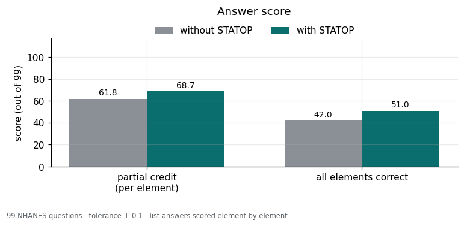
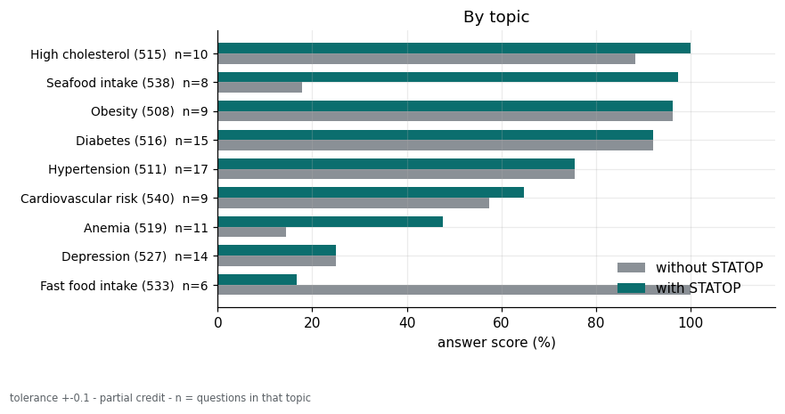
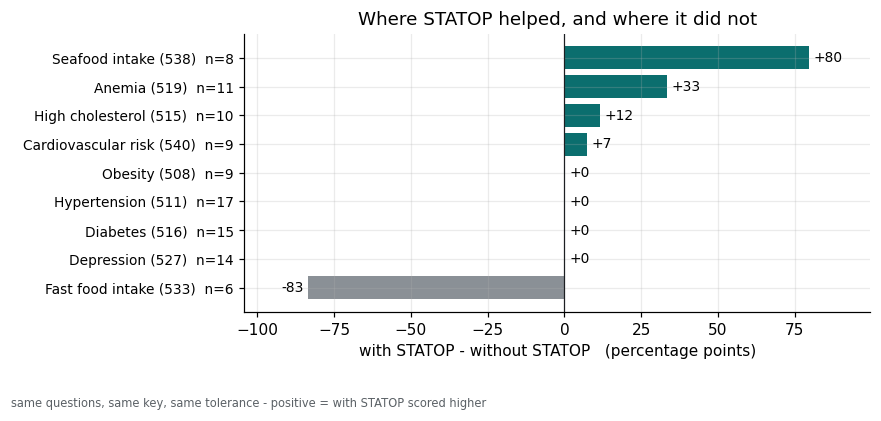
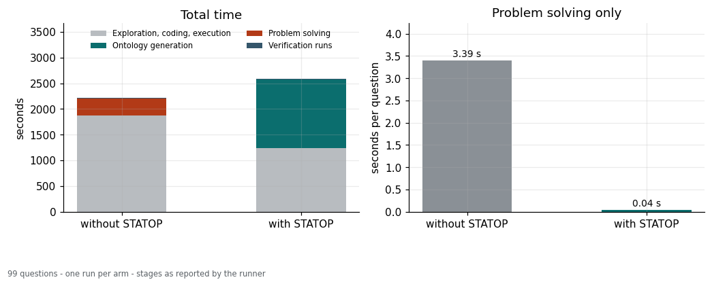

# STATOP — STATistic Ontology Platform

**Closing the statistics gap between AI agents and human users**

**with an ontology of hypotheses that links data, tests, and metrics, not just the metrics alone.**

`v1.0.0`

---

## Sink · Multiple · Chain


**1. Sink**

One view of the data, whoever runs it. Agents and people read the same statistics — so the conversation starts at interpretation.

**2. Multiple**

No hypothesis rests on a single number. Goal, Support, and Guardrail metrics, side by side.

**3. Chain**

Data, hypothesis, metrics — recorded as one snapshot. Apply the same lens to new data, or ask new questions of the same data.


## Ask it

| | |
|---|---|
| **Is this data intact?** | Compare two exports of a table — what changed, and where |
| **Which test fits hypothesis?** | Describe the question in plain words. Get candidate tests |
| **Which statistic fits this hypothesis?** | Check a chosen test against the data — with the reason for every verdict |

---

## Install

Conda : [conda](https://docs.conda.io/en/latest/miniconda.html).

```bash
git clone https://github.com/WoobeenJeong/STATOP_public.git statop
cd statop
conda env create -f environment.yml
conda activate statop
pip install -e .
```

Check: `statop --help` works, `pytest -q` says 949 passed.

## Two ways to drive it

**Terminal** / **Web**
Screenshots are in the Korean section below.

## Six steps

| | a human user clicks | and gets |
|---|---|---|
| 1 | **OPEN** | the columns, with missing rate and unique count |
| 2 | **RETRIEVE** | a work area holding only those |
| 3 | **TYPE CONFIRM** | a label opens 0/1 mapping right there |
| 4 | **SET METRIC** | the tests that fit, ✅ / ⚠ / ⛔ with reasons |
| 5 | **CHECK HYPOTHESIS** | the value, p, and whether this sample could catch it |
| 6 | **SELECT GOAL METRIC** | Support and Guardrail metrics to report alongside |

**Integrity check** : Compare two files and see exactly what differs. Columns that don’t match by name can be paired by hand.

**Derived column** : Builds a new one from a formula — and a saved formula can be reapplied to a different dataset.

<!-- agent-notes:start -->
## With an AI agent

`CLAUDE.md` / `AGENTS.md` ship with the repo, so an agent reads the rules on entry.
Let STATOP judge and the agent explain — every verdict has written grounds in
`rules/`

<!-- agent-notes:end -->

## Walkthroughs

Click through them in the browser — nothing to install, all data synthetic.

- [01 · group correlation](https://woobeenjeong.github.io/STATOP_public/001.html)
- [02 · the distribution decides](https://woobeenjeong.github.io/STATOP_public/002.html)
- [03 · integrity check](https://woobeenjeong.github.io/STATOP_public/003.html)

---
---

# 한국어

**STATOP — AI 에이전트와 사람 사이의 통계 격차를 줄입니다.**
**통계지표만 남기지 않고, 데이터·가설검정·통계지표를 잇는 온톨로지로.**

## Sink · Multiple · Chain

**1. Sink**

누가 돌려도 데이터를 보는 시각은 하나. 에이전트와 사람이 같은 통계량을, 논의는 해석에서 시작.

**2. Multiple**

가설은 숫자 하나로 판단하지 않는다. Goal · Support · Guardrail 지표를 나란히.

**3. Chain**

데이터, 가설검정, 통계지표 — 하나의 스냅샷으로 기록. 같은 렌즈를 새 데이터에, 같은 데이터에 새 질문을.


## 세 가지 질문

| | |
|---|---|
| **이 데이터, 무결한가?** | 같은 표의 두 판본을 대조 — 무엇이 어디서 바뀌었나 |
| **이 가설엔 어떤 검정이 맞나?** | 질문을 일상어로 쓰면 후보 검정이 나온다 |
| **고른 검정, 데이터에 맞나?** | 고른 검정을 데이터에 대조 — 모든 판정에 이유와 함께 |

## 설치

```bash
git clone https://github.com/WoobeenJeong/STATOP_public.git statop
cd statop
conda env create -f environment.yml
conda activate statop
pip install -e .
```

확인: `statop --help` 가 뜨고 `pytest -q` 가 949 passed.

## 조작은 두 가지

- **터미널**: `statop`
- **웹**: `웹열기 선택`


<details>
<summary> [OPEN IMAGE] 타입 추론 및 분포 관찰</summary>


</details>

<details>
<summary> [OPEN IMAGE] 통계량 및 가설 저장 </summary>


</details>

## 성적









## 핵심 단계

| | 클릭 | 작동 |
|---|---|---|
| 1 | **열기** | 컬럼 목록 · 결측률 · 고유값 수 |
| 2 | **가져오기** | 선택한 특정 컬럼만 담긴 작업 영역 |
| 3 | **타입 확정** | 분포확인, 라벨이면 0/1 코드 지정 |
| 4 | **지표 찾기** | 맞는 검정 지표들, ✅ / ⚠ / ⛔ 과 이유 |
| 5 | **가설 검정** | 값·p, 그리고 이 표본으로 잡히는 크기인지 |
| 6 | **Goal 선택** | 함께 볼 Support · Guardrail 지표도 선택 |

**무결성 검증** : 두 파일을 대조해 무엇이 다른지 정확히 봅니다. 이름이 다른 컬럼은 직접 짝지을 수 있습니다.

**파생 컬럼** : 수식으로 새 컬럼을 만듭니다 — 저장한 수식은 다른 자료에 다시 적용할 수 있습니다.


## 에이전트와 함께

`CLAUDE.md` · `AGENTS.md` 가 들어 있어 에이전트가 들어오면 규칙을 읽습니다.
판정은 STATOP 이, 설명은 에이전트가 — 근거가 `rules/` 에 글로 적혀 있어 지어내지 않고 인용합니다.

## 둘러보기

설치 없이 브라우저에서 클릭만으로. 자료는 전부 합성입니다.

- [01 · 군별 상관](https://woobeenjeong.github.io/STATOP_public/001.html)
- [02 · 분포에 맞는 공식](https://woobeenjeong.github.io/STATOP_public/002.html)
- [03 · 무결성 검증](https://woobeenjeong.github.io/STATOP_public/003.html)

---

## Troubleshooting

| symptom | 증상 | cause | 원인 |
|---|---|---|---|
| `statop: command not found` | 명령을 못 찾음 | `conda activate statop` not run | `conda activate statop` 을 빠뜨림 |
| web will not open | 웹이 안 열림 | the `statop serve` terminal was closed | `statop serve` 터미널을 닫음 |
| garbled Korean | 한글이 깨짐 | terminal is not UTF-8 | 터미널 인코딩 (Windows `chcp 65001`) |
| no tests offered | 검정이 안 뜸 | fewer than two columns, or types unconfirmed | 컬럼이 둘 미만이거나 타입 미확정 |

Storage · 저장 위치 `~/.statop/<user>/` (`STATOP_HOME`) · English messages `--lang en`
